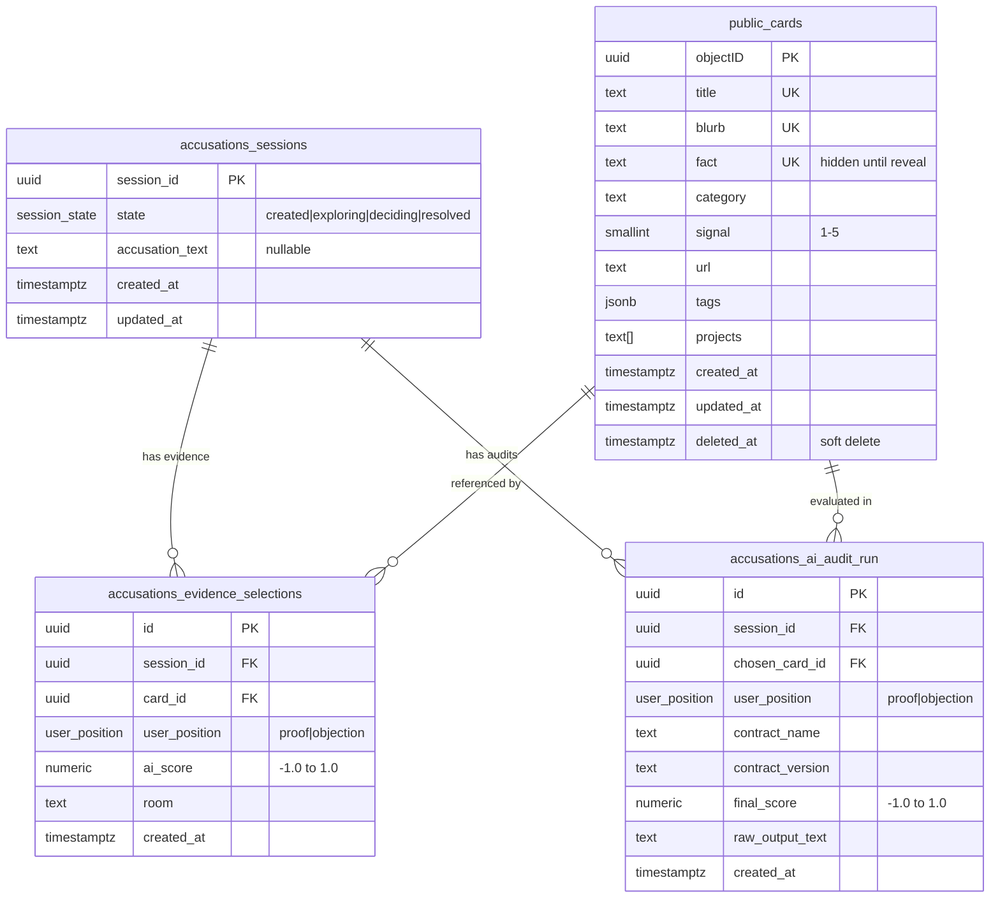
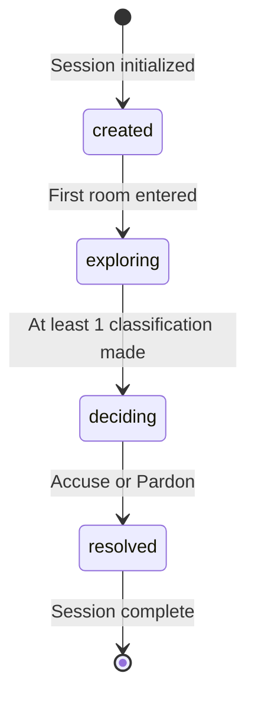

# Data Model — House of Accusations

## Schema Overview

Two PostgreSQL schemas in the `supascribe-notes` Supabase project:

- **`public`** — Existing card corpus (read-only from the game)
- **`accusations`** — Game session data (created by migration `20260308000001`)

## Entity Relationship Diagram



## Session State Machine



## RLS Policy Summary

| Table | SELECT | INSERT | UPDATE | DELETE |
|-------|--------|--------|--------|--------|
| `public.cards` | anon (default) | — | — | — |
| `accusations.sessions` | anon | anon | anon | — |
| `accusations.evidence_selections` | anon | anon | — | — |
| `accusations.ai_audit_run` | anon | anon | — | — |

All policies use `USING (true)` / `WITH CHECK (true)` — no authentication
required (public portfolio experience).

## Card Query Pattern

```sql
SELECT "objectID", title, blurb, category, signal, url, tags
FROM public.cards
WHERE category = :room
  AND signal > 2
  AND "objectID" NOT IN (:consumed_ids)
ORDER BY random()
LIMIT 6;
```

Note: `fact` column is excluded from player-facing queries — visible only to
The Auditor and at final reveal.
